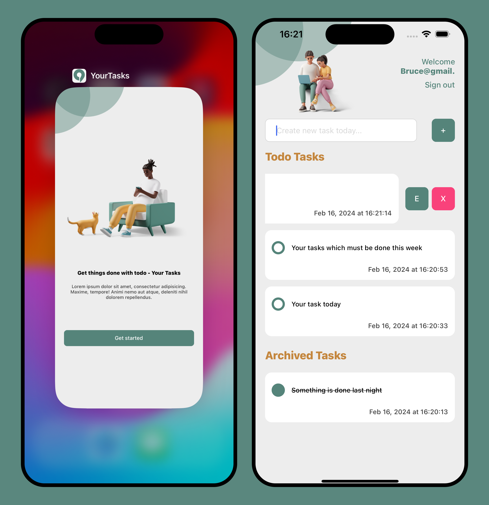
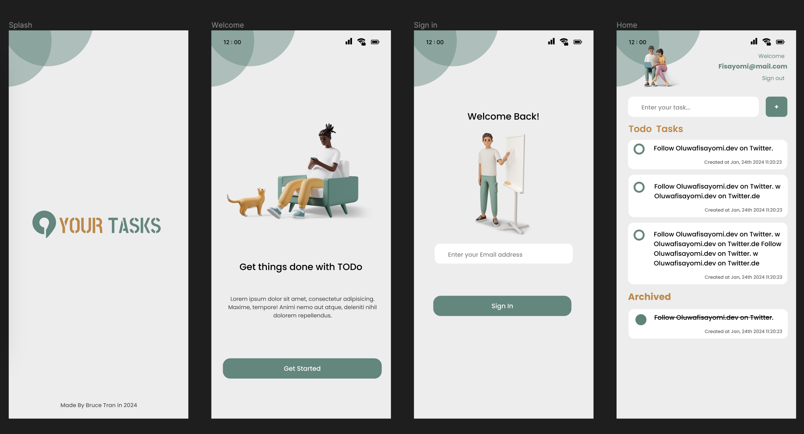

# Todo App: YourTasks


This is the small project built by [**React Native**](https://reactnative.dev) using [`@react-native-community/cli`](https://github.com/react-native-community/cli).

This mobile apps can be actived on both iOS and Android platforms.



# Getting Started

>**Note**: Make sure you have completed the [React Native - Environment Setup](https://reactnative.dev/docs/environment-setup) instructions till "Creating a new application" step, before proceeding.

## Step 1: Install and start metro server

```bash
# install easlily with using npm
npm i

# or yarn
yarn
```

First, you will need to start **Metro**, the JavaScript _bundler_ that ships _with_ React Native.

To start Metro, run the following command from the _root_ of your React Native project:

```bash
# using npm
npm start

# OR using Yarn
yarn start
```

## Step 2: Start your Application

Let Metro Bundler run in its _own_ terminal. Open a _new_ terminal from the _root_ of your React Native project. Run the following command to start your _Android_ or _iOS_ app:

### For Android

```bash
# using npm
npm run android

# OR using Yarn
yarn android

# Open Android Studio, set up device manager and open the simulator to run the demo.

# Open Android Studio, use the real device to run this application directly.

# If the Metro Server and mobile device (both simulator and reality), please run this command to connect the proxy to metro server again:
adb reverse tcp:8081 tcp:8081
```

### For iOS

```bash
# using npm
npm run ios

# OR using Yarn
yarn ios

# Open Xcode and run this application with iOS simulator

# Open Xcode, if you have an Apple account developer, connect with the real device to run this application directly.
```

If everything is set up _correctly_, you should see your new app running in your _Android Emulator_ or _iOS Simulator_ shortly provided you have set up your emulator/simulator correctly.

This is one way to run your app — you can also run it directly from within Android Studio and Xcode respectively.

## Step 3: Project Structure

This project used some main libraries to build the structure from the scratch:

- `React Navigation` (version v6.x): Handle the navigation for all screens.
- `React.Context`: Apply to solve authentication flow
- `Redux Toolkit` (version v2.x): Handle the state management in the project.
- `AsysnStorage`: it is used to save the local data in the user's device. And it is designed as the api with full services CRUD (Create / Update / Delete / Retrieve) in this project.
- `Reanimated` (version v3.x) and `Gesture Handler` (version v2.x): it is used to get the simple gesture to swipe the actions (update & delete).

The structure:

```bash
|- index.js
|---- android/ # native builder for Android platform
|---- ios/ # native builder for iOS platform
|---- __tests__/ # unit tests are here
|---- jest/setup.js # jest file for setting
|---- babel.config.js # set up babel config to the project
|---- tsconfig.json # set up typescript config to the project
|---- react-native.config.js # set up to access the assets data (images, fonts) in the project
|---- apps/ # source code is here
      | ---- assets/ # store the assets files as images and fonts
      | ---- commons/ # configure the text-contents, retrieving images, screen names and theme of the project
      | ---- context/ # include some contexts (handled by React.Context) to use in the project
            | ---- AuthContext.tsx # Process the authentication flow
      | ---- cores/ # Pure UI components will be created and used from here
      | ---- redux/ # Configure the state management with Redux toolkit
      | ---- screens/ # define all screens using in the project
      | ---- storages/ # define all services using with AsyncStorage.
      | ---- App.tsx # Main component in the project
```

## Step 4: Design Figma

This Figma design is the open source in Figma community, and we could adjust some details to make sense the project.

- Link is here: [**Your Tasks Design**](https://www.figma.com/file/qoJoHiC2TlzZc3MSGCyzpa/Todo-List-App-(Community)?type=design&node-id=0%3A1&mode=design&t=C7gzL8xuTD4JeXyT-1)



# Requirements

**YourTasks** followed some below requirements to solve:

✅ Build a simple to-do list application using React Native.
- Handle 4 UI screens: **Splash**, **Welcome**, **Sign In**, **Home**
- Set up some components supporting UI as: **themes**, **fonts** and **cores** (for base UI elements).
- Set up the stack of navigation for all screens.

✅ List items should be stored in Async Storage. Implement the basic CRUD (Create, Read, Update, Delete) operations for list items
- Set up `Task` model to define the data stored in local device.
- Set up some services (CRUD) to manage data with `AsyncStorage`
- At **Home Screen**, we have 2 task collections: `Todo` and `Archived`. We have full actions to manage the tasks here


✅ Implement Login screen with AuthContext (using react context), isAuthenticated flag should be stored in context state and Async Storage to keep user logged-in after app reload
- Set up `React.Context` with `context/AuthContext.tsx` to handle the authentication flow at the **Splash Screen**.
- Check the logged-in user after reloading or opening with `apis.getCurrentUser()`

# Optionals

✅ Set up **Redux** (`@reduxjs/toolkit` latest version) to process the state management professionally while we have a detail plan for the future.

✅ Set up **Redux Thunk** to process the asynchronous handler, **Redux Logger** to track every actions in the development environment.

✅ Set up **React Native Reanimated v3** and **React Native Gesture Handler** to work simple animation when user want to modify the task (using `Swipable` animation to handle it)

✅ Set up `KeyboardAvoidingView` and `TouchableWithoutFeedback` to handle the keyboard which help to increase the user experience.

✅ Set up some unit tests with Jest, most test cases is about the snapshot test.

# Build and release the application

This project is ready to build for testing and production. In order to handle these tasks, we can process step by steps following the below instructions.

## 1. For Android

We have available 2 keystores for testing and releasing.

```bash
# testing
- android/app/debug.keystore

# Run to build a .APK file for test
- Open Android Studio
- Choose and run "Generate Signed Bundle/APK"
- Choose "AAB" option and click "Next" and run to build.

# production
- android/app/yourtasks.keystore

# Run to build a .AAB file (Android App Bundle) for production
- Open Android Studio
- Choose and run "Generate Signed Bundle/APK"
- Choose "APK" option and click "Next" and run to build.
```

## 2. For iOS

Only 1 option for building and releasing, this is what you have to register an account developer from Apple Programs.

- Sign in Xcode with Apple Account
- Configure this Apple Account profile to the project
- Choose option: `Any iOS Device (arm64)`
- Choose `Build` -> `Archive` and run.
- Sign in to `AppStoreConnect` to create the new project and set up `Testflight` to distribute the testing application
- Also use `AppStoreConnect` to release the production with the similar flow.

# Conclusion

This is only the repository to practice the React Native framework, and I hope to help you to get something which is helpful.
